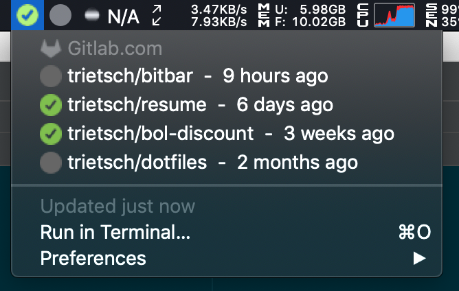

# Bitbar scripts
This repo contains my personal Bitbar scripts.

## Installation
To install Bitbar, run:

`brew cask install bitbar`

After installation, open Bitbar and choose this repo location as the Bitbar Plugin Folder.

## Modules

### Gitlab
Integrates with (multiple) Gitlab hosts and shows the status like CCMenu does. At the moment, Gitlab does not offer a `cc.xml` that Jenkins does, so this is a workaround.



**Note**: bugs may still exist.

To change the settings, copy the `.gitlab-config.template.ini` to `.gitlab-config.ini` and adjust to your own preferences. By default, only projects are included that you've starred and of which you're a member. So if you don't change that behavior, go to the Gitlab instances and star the projects that you want to see.

**Important**: change the hashbang at the top of the file, to point to a Python 3 executable if the generic hashbang doesn't work for you. I've tried to create a hashbang that just looks at the default location that `pyenv` is installed

#### Dependencies

If you want to use the current hashbang at the top of the file, make sure you've got `pyenv` installed:

- `brew install pyenv`
- `pyenv install 3.6.0` -> if you run into issues, see FAQ.

Install the following Python packages (`pip install ...`):
- timeago
- python-dateutil
- requests

#### Improvements

Add notifications, overwriting each run result in a pickle file, in order to compare whether checkins have fixed the build, whether there was another successful build, etc.

#### FAQ

Q: I'm unable to install Python 3.6.0 due to `zlib` and errors while building Python 3.6.0.
A:
- Run `brew install zlib`
- Add the following to your `.bash_profile`, `.bashrc`, `.zprofile`, `.zshrc`, or similar:
```
# zlib
# For compilers to find zlib you may need to set:
export LDFLAGS="-L/usr/local/opt/zlib/lib"
export CPPFLAGS="-I/usr/local/opt/zlib/include"

# For pkg-config to find zlib you may need to set:
export PKG_CONFIG_PATH="/usr/local/opt/zlib/lib/pkgconfig"
```
- Run `brew uninstall --ignore_dependencies openssl && brew install openssl && CFLAGS="-I$(brew --prefix openssl)/include" LDFLAGS="-L$(brew --prefix openssl)/lib" pyenv install 3.6.0` to successfully install Python 3.6.0. After that, you can run the `pip install` commands.