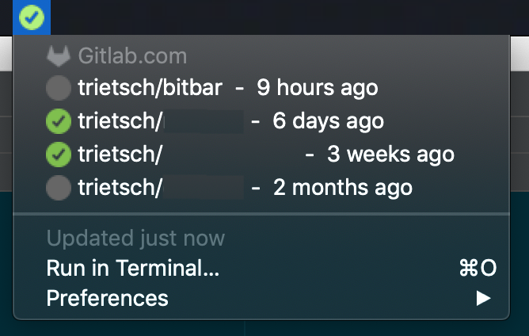
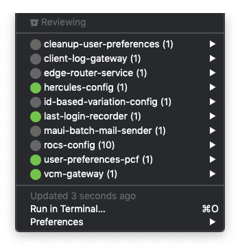

# Bitbar scripts
This repo contains my personal Bitbar scripts.

## Installation
The following steps are required to run Bitbar scripts (that use Python):
1. Ensure that Bitbar is installed: `brew cask install bitbar`
1. Open Bitbar and choose `/scripts` as the Bitbar Plugin Folder.
1. Copy the scripts you want to enable `scripts/template` to `scripts`
1. Make sure you have Python 3 installed (tested with `3.7.4`): `brew install python3`
1. For the modules below, you need to install some Python dependencies: `pip install timeago python-dateutil requests azure-devops`
1. In order to use a module, copy the template config (found in `config/template/<module-name>.template`) to `config/<module-name>.ini`, e.g.: `cp config/template/bitbucket-config.template config/bitbucket-config.ini`.

## Update 10-02-2020
1. Copy the scripts you want to enable `scripts/template` to `scripts`
1. Install `azure-devops` with `pip` if you want to use the Azure Devops module
1. Add the `[python]` section with the path to the Python binary in each `.ini` file you already created
1. Create an `azure_devops-config.ini` file if you want to to use that module

## Modules
### Gitlab
Integrates with (multiple) Gitlab hosts and shows the status like CCMenu does. At the moment, Gitlab does not offer a `cc.xml` that Jenkins does, so this is a workaround.



To change the settings, copy the `.gitlab-config.template.ini` to `.gitlab-config.ini` and adjust to your own preferences. By default, only projects are included that you've starred and of which you're a member. So if you don't change that behavior, go to the Gitlab instances and star the projects that you want to see.

#### Improvements
Add notifications, overwriting each run result in a pickle file, in order to compare whether checkins have fixed the build, whether there was another successful build, etc.

### Bitbucket PRs
Show open PRs in a Bitbucket instance with a status whether you've still got PRs to review.



To change the settings, copy the `.bitbucket-config.template` to `.bitbucket-config.ini` and adjust to your own preferences. PRs that you have marked as approved can be omitted, by setting the value in the configuration.

## FAQ

Q: I'm unable to install Python 3.6.0 due to `zlib` and errors while building Python 3.6.0.

A:
- Run `brew install zlib`
- Add the following to your `.bash_profile`, `.bashrc`, `.zprofile`, `.zshrc`, or similar:
```
# zlib
# For compilers to find zlib you may need to set:
export LDFLAGS="-L/usr/local/opt/zlib/lib"
export CPPFLAGS="-I/usr/local/opt/zlib/include"

# For pkg-config to find zlib you may need to set:
export PKG_CONFIG_PATH="/usr/local/opt/zlib/lib/pkgconfig"
```
- Run `brew uninstall --ignore_dependencies openssl && brew install openssl && CFLAGS="-I$(brew --prefix openssl)/include" LDFLAGS="-L$(brew --prefix openssl)/lib" pyenv install 3.6.0` to successfully install Python 3.6.0. After that, you can run the `pip install` commands.

### Azure DevOps
Show open PRs in an Azure Devops organization with a status whether you've still got PRs to review.
To change the settings, copy the `.bitbucket-config.template` to `.bitbucket-config.ini` and adjust to your own preferences. PRs that you have marked as approved can be omitted, by setting the value in the configuration.

### Man of the Day schedule
Reads the MotD for today from an iCalendar feed, and shows the first name. Go the the Confluence page, subscribe to the MotD calendar and add it to the config file for the MotD (without quotes). Make sure you install the package `ics`: `pip install ics`.
